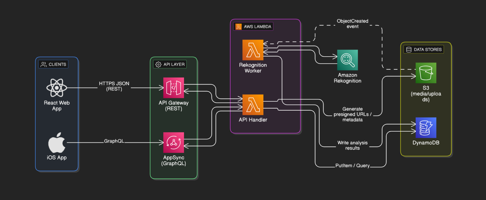

# GARDIAN SafePassage System

GARDIAN stands for Geospatial Aid Response & Disaster Information Analysis Network

The system is used to coordinate reporting and situational awareness for Non-Combatant Evacuation Operations (NEO) and disaster relief operations.



The GARDIAN Safe Passage System is essentialls two seperate apps.

- **SafePassage iOS app**: This element is our USP, it's to be used by evacuees in the field to report their situation to authorities and request help or evacuation.
- **GARDIAN REACT Web App dashboard** monitored by command posts operators on behalf of the Military or FCDO commanders. Data captured on mobile flows through AWS services to populate the live map, intelligence panels, and messaging tools that power decision making during crisis response. 

## Platform Overview
- Citizens with the SafePassage iOS application can report their location, status, send in images, request evacuation and more.
- AWS Amplify, AppSync, Lambda, GraphQL, Cognito, and S3 synchronise structured data and media into shared mission datasets.
- The GARDIAN Dashboard renders hazard overlays, entitled-person locations, and curated intelligence as a single operational view for the Military/FCDO Commanders.
- Messaging and planned automations close the loop between command guidance and citizens awaiting extraction.

- More in depth README files for the [Dashboard Web App](https://github.com/AstraAppivate/hackathon-2025-team-3/blob/main/Dashboard/README.md) can be found in the Dashboard folder and for the [iOS App](https://github.com/AstraAppivate/hackathon-2025-team-3/blob/main/SafePassage/README.md) in the iOS folder.

## Component Highlights

### GARDIAN Dashboard (React + MapLibre)
- MapLibre plus AWS Location Service tiles deliver fast, styleable mapping with hazard polygons sourced from S3 or configurable GeoJSON endpoints.
- Entitled-person feeds render colour-coded pins, aggregate evacuation statistics, and support targeted messaging via the messaging router.
- Intelligence, weather, contacts, and doctrine panels surface the wider mission context while maintaining a command-centre look and feel.
- Built with Vite for rapid iteration, linting (`npm run lint`), and production builds ready for static hosting.

### SafePassage iOS App (SwiftUI + Amplify)
- SwiftUI guides users through authentication, hazard capture, photo upload, and evacuation prioritisation in the field.
- Amplify-configured Cognito, AppSync (GraphQL), and S3 provide secure sync, image storage, and real-time data propagation.
- MVVM architecture separates views, models, and services so new data fields or workflows can be added quickly.
- Designed for iOS 16+ with Combine for reactive updates and native gestures for a familiar mobile experience.

## Data and Services

| Service / Resource | Used By | Purpose |
| --- | --- | --- |
| AWS Cognito | SafePassage, GARDIAN | Authentication and session management for field and command users. |
| AWS AppSync (GraphQL) | SafePassage | Real-time mutation and subscription layer for reports, status, and metadata. |
| AWS S3 | SafePassage, GARDIAN | Storage for imagery, hazard GeoJSON, and other mission assets. |
| AWS Location Service + MapLibre | GARDIAN | Base maps, navigation controls, and responsive hazard rendering. |
| Messaging Router API | GARDIAN (planned SafePassage integration) | Sends instructions from command staff back to individuals in the field. |

## Repository Layout

```text
hackathon-2025-team-3/
  Dashboard/          # GARDIAN dashboard source, assets, and build scripts
  SafePassage/        # SafePassage iOS workspace and Amplify backend config
  potentialmaplibre.jsx
  README.md           # Combined platform overview (this file)
```

Refer to `Dashboard/README.md` and `SafePassage/README.md` for deep dives, API references, and component-specific setup.

## Getting Started

### React Web App Dashboard

Prerequisites: Node.js 18+, npm, AWS Location Service API key & Weather API key.

```bash
git clone https://github.com/AstraAppivate/hackathon-2025-team-3.git
cd Dashboard
# create .env with VITE_AWS_LOCATION_KEY, VITE_OPENWEATHER_API_KEY and asertain your own API keys.
npm install
npm run dev
```

The dev server runs on `http://localhost:5173`. Use `npm run build` to emit production assets to `dist/`.

### iOS App

Prerequisites: macOS (Ventura or later), Xcode 14+, Amplify CLI (`npm install -g @aws-amplify/cli`), AWS account.

```bash
cd SafePassage
amplify init           # or reuse the provided Amplify backend configuration
amplify push
open SafePassage.xcodeproj   # open SafePassage.xcworkspace when using CocoaPods
```

Select an iOS 16+ simulator or device and run with `Cmd+R`. Ensure `amplifyconfiguration.json` and `awsconfiguration.json` contain the credentials for your Amplify environment.

## Operational Flow

1. Field personnel authenticate through Cognito and submit hazard reports, photos, and prioritisation flags via SafePassage.
2. Amplify propagates structured data and media to AppSync, DynamoDB, and S3.
3. GARDIAN Dashboard fetches hazard overlays, entitled-person feeds, and mission intelligence to present a single operational view.
4. Command staff monitor metrics, review reports, and craft instructions that flow back through the messaging router.
5. Planned enhancements add live tracking, richer analytics, and offline resilience for both sides of the platform.

## Current Features 

- **AWS Map**: To enable the relevant commanders to view the situation on the ground. Capabale of displaying various overlays and featres from AWS.
- **Entitled Persons Statistics**: To display a list of persons on the map and if they have requested evacuation or not.
- **Dark/Light Mode**: The website is default dark mode as we can all agree it's far superior ;) but the user has the option to switch to light mode to aid accessibility.
- **Export Functionality**: The user can click either export the entire dashboard this puts the entire webpage snapshot onto a PDF, The other option is the ability to export all current users on the map's details into either a CSV file, Word Doc Table or PDF Table. This enables rapid sharing of data.
- **Local News Report Feed**: So far we have a placeholder for this but eventually will use GNews, GDELT and Guardian API's to display news related to a user/commanders search terms.
- **AI Scene Assessment**: We have the ability to utilise the iOS app to send a photo to AWS and have AWS Rekognition analyse the photograph and itdentify what the user has claimed, for example determine if it's a valid picture of a flood, or people with Weapons etc... to give commanders confidence false reports aren't coming in.
- **Operational Weather Outlook**: This uses an API to fetch local weather and display it on the site to enable commanders to gain greater environmental insights.
- **Evacuation & Assistance Request Table**: A placeholder area to display a current list of all people on the map.
- **Quick Contacts Area**: Highlighting to the Commander a list of quick key contacts they may need, including PJHQ, FCDO, UK Embassy etc...
- **Doctrine & Support References**: An area to display JDP-3-51, the FCDO Policy and Allied Joint Doctrine for NEO.

## Future Features Roadmap

- **The Web App hosted on AWS**: As it stands the Web App is run locally, we would look to put this on AWS.
- **The addition of proper user authentification**: To ensure proper security we must ensure users of the app are tracked and ensure their data on their own device is protected.
- **Greater cross platform support**: The initial apps take the form of a web app and an iOS app, we would look to offer an Android Mobile App, a Windows, Linux and MacOS Desktop app in the future for both SafePassage and GARDIAN.
- **Ability to drop Pins, Polygons, Other Shapes Manually**: Currentley the operator of the Dashboard cannot add these features manually on the dashboard they are fed in from AWS, it's a high priority to allow them to do this.
- **Real time News Feed with LLM analysis**: We'd like to connect GNews, Guardian and GDELT API's to automatically pull in real news stories based on the region the map is centred on, firther on from this it would include LLM analysis and summaries.
- **Real time tracking**: Currentley the user sends their position once and that's it, we would look to actually implement AWS Real time tracking to enable us to track the user if they give permission locally.
- **Greater Accesibility**: The dashboard has both a dark and light mode but further work to check if it's suitable for screen readers, the ability to interact using voice, potentially using OpenAI realtime voice/vision services would improve accesibility.
- **Support for other languages**: Utilising AWS hosted Machine Translation this will enable greater interoperability with foreign partners.
- **Offline Mode**: The ability to utilise the application disconnected, you could save things locally and set it to send automatically to the backend once re-connected.

## License

MIT


# GARDAIN
